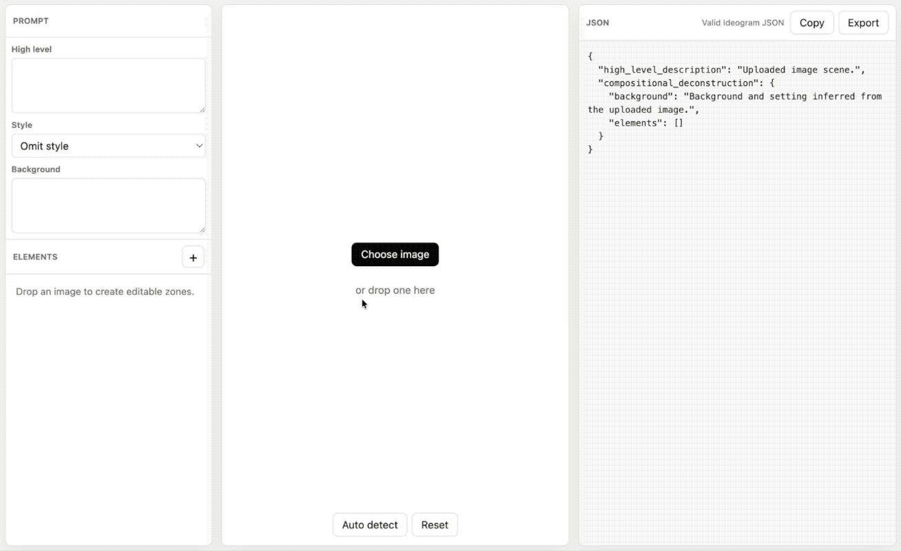

# Image to Prompt



Image to Prompt is a minimal local web app that turns an uploaded image into editable Ideogram 4 JSON prompt. 

[Florence-2](https://huggingface.co/collections/microsoft/florence) drafts the scene, object boxes, region captions, and OCR regions. The UI lets you drag, resize, rename, duplicate, delete, hide, add zones, and optionally add a structured `style_description` before copying or exporting the JSON.

## Install

### 1. 1-click install with Pinokio

The easiest way to install and run Image to Prompt is with [Pinokio](https://pinokio.co).


### 2. Install manually

Clone or download this repository, then install the Python dependencies from the `app` folder:

```bash
cd app
python -m venv env
source env/bin/activate
uv pip install -r requirements.txt
```

On Windows, activate the environment with:

```powershell
.\env\Scripts\Activate.ps1
```

Install PyTorch for your platform. For most CPU and Apple Silicon setups:

```bash
uv pip install torch==2.7.0 torchvision==0.22.0 torchaudio==2.7.0 --index-url https://download.pytorch.org/whl/cpu --force-reinstall
```

For NVIDIA CUDA 12.8:

```bash
uv pip install torch==2.7.0 torchvision==0.22.0 torchaudio==2.7.0 --index-url https://download.pytorch.org/whl/cu128 --force-reinstall
```

Start the app:

```bash
PYTORCH_ENABLE_MPS_FALLBACK=1 TOKENIZERS_PARALLELISM=false FLORENCE_MODEL=microsoft/Florence-2-base-ft python app.py --host 127.0.0.1 --port 7860
```

On Windows PowerShell:

```powershell
$env:PYTORCH_ENABLE_MPS_FALLBACK="1"; $env:TOKENIZERS_PARALLELISM="false"; $env:FLORENCE_MODEL="microsoft/Florence-2-base-ft"; python app.py --host 127.0.0.1 --port 7860
```

Then open `http://127.0.0.1:7860`.

To use a different Florence-2 model, replace `microsoft/Florence-2-base-ft` with another model id, such as `microsoft/Florence-2-large-ft`. The first run downloads model files from Hugging Face, so it may take longer than later launches.

## How to Use

1. Drop an image into the center canvas or click **Choose image**.
2. Wait for Florence-2 to draft the editable zones.
3. Drag or resize boxes directly on the image.
4. Edit item labels, literal text, descriptions, and types in the left panel.
5. Copy or export the JSON from the right panel.

By default the app omits `style_description`, because Ideogram 4 treats it as optional and Florence-2 does not reliably infer structured style fields. Select a style preset if you want the app to include a schema-valid `style_description`; those presets are app defaults, not official Ideogram presets.

The default model is `microsoft/Florence-2-base-ft` for low memory use. To use another Florence-2 model, start with a `model` parameter, for example `microsoft/Florence-2-large-ft`.

## API

The app exposes a single analysis endpoint:

`POST /api/analyze`

Form field:

- `file`: image file upload

Response:

- `image`: uploaded image dimensions
- `model`: model used
- `caption`: generated scene caption
- `background`: generated background description
- `palette`: sampled color palette
- `elements`: editable objects/text regions with normalized Ideogram bboxes
- `json`: Ideogram 4 JSON prompt following the documented caption schema

### JavaScript

```js
const form = new FormData()
form.append("file", fileInput.files[0])

const response = await fetch("http://127.0.0.1:7860/api/analyze", {
  method: "POST",
  body: form
})

const result = await response.json()
console.log(result.json)
```

### Python

```python
import requests

with open("image.png", "rb") as image_file:
    response = requests.post(
        "http://127.0.0.1:7860/api/analyze",
        files={"file": image_file},
    )

print(response.json()["json"])
```

### Curl

```bash
curl -X POST http://127.0.0.1:7860/api/analyze \
  -F "file=@image.png"
```
